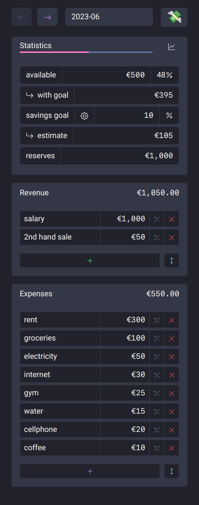
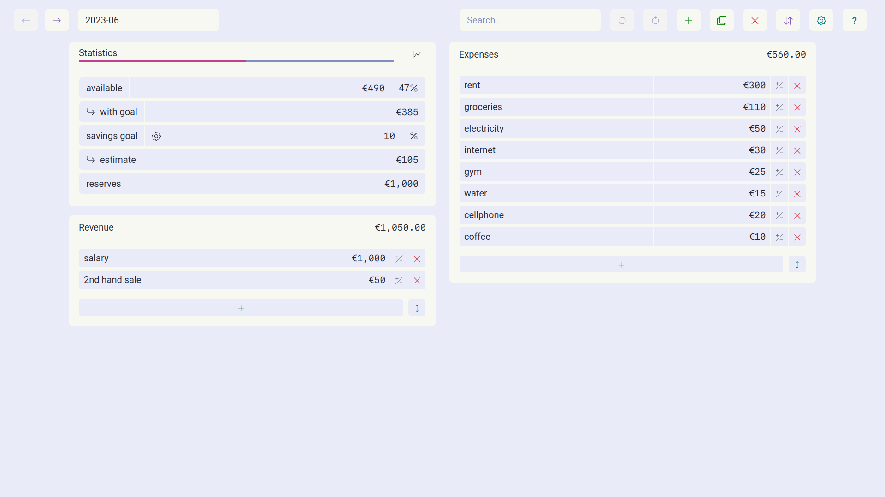
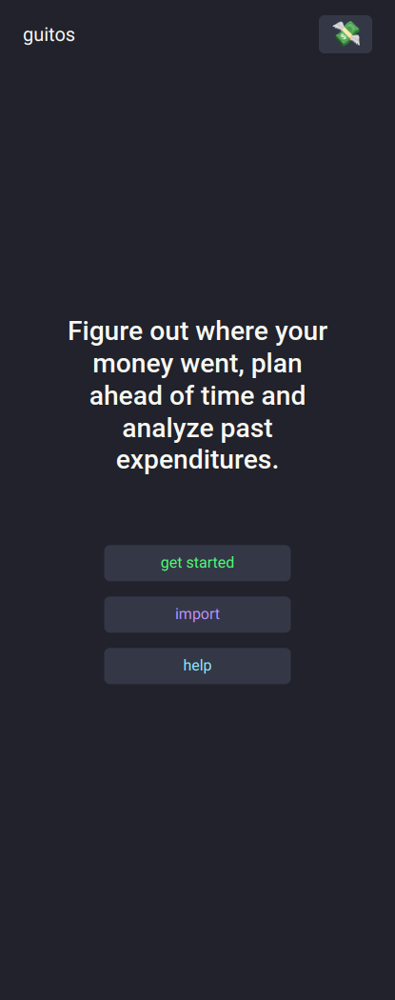
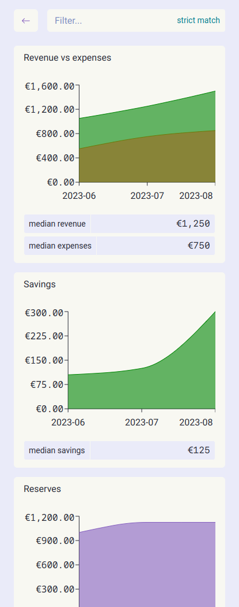

# 💸 guitos

<details>
<summary>Table of Contents</summary>

- [About](#about)
- [Published On](#published-on)
- [Getting Started](#getting-started)
  - [Prerequisites](#prerequisites)
  - [Installation](#installation)
- [Usage](#usage)
- [Notes](#notes)
- [Related Projects](#related-projects)
- [Built With](#built-with)
- [Hosted On](#hosted-on)
- [Roadmap](#roadmap)
- [Support](#support)
- [Contributing](#contributing)
- [Authors & contributors](#authors--contributors)
- [Security](#security)
- [License](#license)
- [Acknowledgements](#acknowledgements)

</details>

<details>
<summary>Screenshots</summary>
<br>

|                                                Horizontal layout                                                 |                                              Vertical layout                                               |
| :--------------------------------------------------------------------------------------------------------------: | :--------------------------------------------------------------------------------------------------------: |
|  |  |

|                                                               Light theme                                                                |                                                            Light theme                                                             |
| :--------------------------------------------------------------------------------------------------------------------------------------: | :--------------------------------------------------------------------------------------------------------------------------------: |
|  |  |

|                                             Tooltip                                              |                                                        Initial state                                                        |
| :----------------------------------------------------------------------------------------------: | :-------------------------------------------------------------------------------------------------------------------------: |
|  |  |

|                                                   Charts                                                    |                                                         Charts light theme                                                         |
| :---------------------------------------------------------------------------------------------------------: | :--------------------------------------------------------------------------------------------------------------------------------: |
|  |  |

</details>

## About

guitos is a personal budgeting app that helps you figure out where your money went, plan your budget ahead of time and analyze past expenditures.

It stores data in your browser's local storage ([IndexedDB](https://developer.mozilla.org/en-US/docs/Web/API/IndexedDB_API)). Your private financial data doesn't leave your browser.

guitos was initially created to replace a spreadsheet and as an opportunity to learn React.

guitos is [portuguese slang](https://en.wiktionary.org/wiki/guito) for money/cash.

## Published On

- [Show HN](https://news.ycombinator.com/item?id=35778328#35786940)
- [producthunt.com](https://www.producthunt.com/products/guitos)
- [store.app](https://store.app/guitos-app)
- [r/SideProject](https://www.reddit.com/r/SideProject/comments/15w7v3g/guitos_a_simple_budgeting_app_that_helps_you/)
- [r/reactjs](https://www.reddit.com/r/reactjs/comments/12s9yph/guitos_a_simple_budgeting_app_that_helps_you/)

## Getting Started

### Prerequisites

1. Any modern browser with javascript enabled.

### Installation

It's not necessary to install anything in order to use this app.

However, if you'd like to use it offline, follow the instructions for your device on:
[web.dev](https://web.dev/learn/pwa/installation#desktop_installation)

## Usage

### Use case example

I receive a salary at the end of each month and around that time I create a new budget to plan the expenses/savings goals/etc.

I frequently add a new expense before I purchase it so I can see the impact on the budget and prepare accordingly.
If everything went according to plan, once I receive a new salary, I transfer the value in the `savings estimate` field to my bank savings account.

Later, I can compare the budget with previous months to understand where the money is going by hovering the mouse/tapping on a single expense. A tooltip pops up and shows its value in percentage of revenue (see the tooltip screenshot above).
The charts page is useful for these kinds of insighs.

There I can see an overview of the evolution of several metrics such as `savings`, `revenue`, etc. If I want to narrow down the chart to a specific type of item I can search for it in the filter searchbox. If I toggle the `strict match` button then only items that are named exactly as the search value are shown in the resulting chart.

### Starting from scratch

1. Visit [guitos.app](https://guitos.app)
2. Create a new budget and name it according to your preferred budget period
   - ideally in one of the following formats: `YYYY-MM` or `YYYY-WN`
3. Input your revenue for the respective period (salary, sales, etc.)
4. Fill in the expenses (groceries, electricity, etc.)
5. Change the savings goal to your preference
6. Update the reserves field with the current value of your emergency fund / cash

### In case you have a backup/would like to import data from another source

1. Visit [guitos.app](https://guitos.app)
2. Import data from single/multiple CSV files or a single JSON file.
   Make sure they follow the required structure:

### CSV data model

```csv
type,name,value
expense,rent,1000.00
expense,food,200.00
income,salary,2000.00
income,sale,100
goal,goal,10
reserves,reserves,0
```

- Note that the name of the CSV file is parsed as the name of the budget:

  `2023-04.csv` results in a budget with the name of `2023-04`.

### JSON data model

```json
[
  {
    "id": "035c2de4-00a4-403c-8f0e-f81339be9a4e",
    "name": "2023-03",
    "expenses": {
      "items": [
        { "id": 1, "name": "expense1", "value": 10 },
        { "id": 2, "name": "expense2", "value": 20 }
      ],
      "total": 30
    },
    "incomes": {
      "items": [
        { "id": 1, "name": "income1", "value": 100 },
        { "id": 2, "name": "income2", "value": 200 }
      ],
      "total": 300
    },
    "stats": {
      "available": 270,
      "withGoal": 240,
      "saved": 270,
      "goal": 10,
      "reserves": 100
    }
  }
]
```

- Note that the ID of each budget inside the JSON file should be a [v4 UUID](<https://en.wikipedia.org/wiki/Universally_unique_identifier#Version_4_(random)>) as created by the `crypto.randomUUID()` [method](https://developer.mozilla.org/en-US/docs/Web/API/Crypto/randomUUID).

### Keyboard shortcuts

Keyboard shortcuts can be triggered when no input field is selected.

| Action                       | Shortcut |
| ---------------------------- | -------- |
| Undo last change             | U        |
| Redo last change             | R        |
| Clone current budget         | C        |
| Create new budget            | A        |
| Open import/export panel     | O        |
| Export data as JSON          | S        |
| Export current budget as CSV | D        |
| Open settings panel          | T        |
| Go to older budget           | PageDown |
| Go to current month's budget | Home     |
| Go to newer budget           | PageUp   |
| Rename current budget        | N        |
| Search                       | F or /   |
| Focus savings goal           | G        |
| Focus reserves               | E        |
| Toggle charts view           | I        |
| Dismiss all notifications    | Escape   |

## Notes

- The undo/redo functionality cannot fix every single action. Export frequently to avoid data loss!
- To undo the deletion of a budget click the undo button in the notification shown just after the action.
  - As soon as the notification fades (after 60 seconds) the undo action is not possible anymore.
- guitos tries to load an existing budget when visiting `guitos.app/budget-name`
- The interface theme is set automatically by your browser and/or operating system's configuration.
- The currency is initially selected according to your browser's preferred languages.
  - Example: English (United States) browser language displays values in US Dollars. English (India) uses Indian Rupees.
  - It's possible to override it by selecting a different currency code based on [ISO 4217](https://en.wikipedia.org/wiki/ISO_4217).
- Querying the search bar finds matching budget/expense/income names, opens the budget that contains the match and highlights it.
- The list of Revenue/Expenses can be reordered by dragging each item after enabling the toggle button.

## Known issues

- Cannot input decimal separator (comma or full stop signs) on expense/income/reserves values:
  - guitos uses [react-currency-input-field](https://github.com/cchanxzy/react-currency-input-field/) to format the income/expense values.
  - `react-currency-input-field` formats these values according to the current browser/phone's locale (language setting). If the locale uses `.` as the official decimal separator, then only this separator is allowed to be input.
    - See the following Wikipedia article for a reference: [Decimal separator](https://en.wikipedia.org/wiki/Decimal_separator)
  - Changing the browser/phone's locale to one that uses the preferred decimal separator should mitigate the problem.

## Related Projects

- [guitos-exporter](https://github.com/rare-magma/guitos-exporter): Bash script that uploads the data from guitos JSON backups to influxdb

## Built With

- [React](https://react.dev/)
- [Bootstrap](https://getbootstrap.com/)
- [React Bootstrap](https://react-bootstrap.github.io/)
- [React Bootstrap Typeahead](https://ericgio.github.io/react-bootstrap-typeahead/)
- [React Icons](https://react-icons.github.io/react-icons/)
- [React Router](https://reactrouter.com/)
- [React Currency Input Field](https://github.com/cchanxzy/react-currency-input-field)
- [React Hotkeys Hook](https://github.com/JohannesKlauss/react-hotkeys-hook)
- [Recharts](https://github.com/recharts/recharts)
- [Big.js](https://github.com/MikeMcl/big.js)
- [localForage](https://localforage.github.io/localForage/)
- [PapaParse](https://papaparse.com/)
- [Vite](https://vitejs.dev/)
- [Typescript](https://www.typescriptlang.org/)
- [Dracula](https://draculatheme.com/)
- [Dracula.min Light](https://github.com/AshGrowem/Dracula.min#dracula.min-Light)
- [use-undo](https://github.com/homerchen19/use-undo)
- [immer](https://github.com/immerjs/immer)
- [use-immer](https://github.com/immerjs/use-immer)
- [usehooks-ts](https://github.com/juliencrn/usehooks-ts)
- [Framer Motion](https://github.com/framer/motion)

## Hosted On

- [Cloudflare Pages](https://pages.cloudflare.com/)

## Roadmap

See the [open issues](https://github.com/rare-magma/guitos/issues) for a list of proposed features (and known issues).

## Support

Reach out to the maintainer at one of the following places:

- [GitHub issues](https://github.com/rare-magma/guitos/issues/new?assignees=&labels=question&template=04_SUPPORT_QUESTION.md&title=support%3A+)
- Contact options listed on [this GitHub profile](https://github.com/rare-magma)

## Contributing

First off, thanks for taking the time to contribute! Contributions are what make the open-source community such an amazing place to learn, inspire, and create. Any contributions you make will benefit everybody else and are **greatly appreciated**.

Please read [our contribution guidelines](CONTRIBUTING.md), and thank you for being involved!

## Authors & contributors

The original setup of this repository is by [Nuno](https://github.com/rare-magma).

For a full list of all authors and contributors, see [the contributors page](https://github.com/rare-magma/guitos/contributors).

## Security

guitos follows good practices of security, but 100% security cannot be assured.
guitos is provided **"as is"** without any **warranty**. Use at your own risk.

_For more information and to report security issues, please refer to our [security documentation](SECURITY.md)._

## License

This project is licensed under the **GNU Affero General Public License v3**.

See [LICENSE](LICENSE) for more information.

## Acknowledgements

- [r/personalfinance](https://www.reddit.com/r/personalfinance/wiki/budgeting/)
- [Eslint](https://eslint.org/)
- [Prettier](https://prettier.io/)
- [Stylelint](https://stylelint.io/)
- [semantic-release](https://semantic-release.gitbook.io/semantic-release/)
- [testing-library](https://github.com/testing-library)
- [vite-plugin-pwa](https://github.com/vite-pwa/vite-plugin-pwa)
- [vitest](https://github.com/vitest-dev/vitest)
- [Choose a license](https://choosealicense.com/)
- [Hands on React](https://handsonreact.com)
- [Playwright](https://playwright.dev/)
