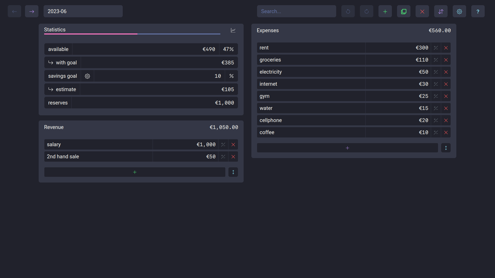
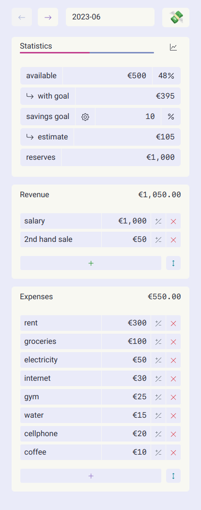

# 💸 Guitos

<details>
<summary>Table of Contents</summary>

- [About](#about)
- [Getting Started](#getting-started)
  - [Prerequisites](#prerequisites)
  - [Installation](#installation)
- [Usage](#usage)
- [Built With](#built-with)
- [Hosted On](#hosted-on)
- [Roadmap](#roadmap)
- [Support](#support)
- [Project assistance](#project-assistance)
- [Contributing](#contributing)
- [Authors & contributors](#authors--contributors)
- [Security](#security)
- [License](#license)
- [Acknowledgements](#acknowledgements)
</details>

<br>

## About

Guitos is a simple budgeting app that helps you figure out where your money went and plan your budget ahead of time.

It stores data in your browser's local storage ([IndexedDB](https://developer.mozilla.org/en-US/docs/Web/API/IndexedDB_API)). Your private financial data doesn't leave your browser.

Guitos was initially created to replace a spreadsheet and as an opportunity to learn React.

Guitos is [portuguese slang](https://en.wiktionary.org/wiki/guito) for money/cash.

<br>
<details>
<summary>Screenshots</summary>
<br>

|                           Horizontal Layout                            |                          Vertical Layout                           |
| :--------------------------------------------------------------------: | :----------------------------------------------------------------: |
|  |  |

|                                    Light theme                                     |                                  Light theme                                   |
| :--------------------------------------------------------------------------------: | :----------------------------------------------------------------------------: |
|  |  |

</details>
<br>

## Getting Started

### Prerequisites

Any modern browser with javascript enabled.

### Installation

It's not necessary to install anything in order to use this app.

However, if you'd like to use it offline, follow the instructions for your device on:
[web.dev](https://web.dev/learn/pwa/progressive-web-apps/#desktop-and-laptops)

## Usage

1. Visit [guitos.app](https://guitos.app)
2. Create a new budget and name it according to your preferred budget period (ideally `YYYY`, `YYYY-MM` or `YYYY-WN`)
3. Input your revenue for the period (salary, sales, etc.)
4. Fill in the expenses (groceries, electricity, etc.)
5. Change the savings goal to your preference
6. Update the reserves field with the current value of your emergency fund / cash

or

1. Visit [guitos.app](https://guitos.app)
2. Import previous data from single/multiple CSV files or a single JSON file.
   Make sure they follow the required structure:

### CSV data model:

```csv
type,name,value
expense,rent,1000.00
expense,food,200.00
income,salary,2000.00
income,sale,100
goal,goal,10
reserves,reserves,0
```

- Note that the name of the csv file is parsed as the name of the budget:

  2023-04.csv results in a budget with the name of "2023-04".

### JSON data model:

```json
[
  {
    "id": "035c2de4-00a4-403c-8f0e-f81339be9a4e",
    "name": "2023-03",
    "expenses": {
      "items": [{ "id": 1, "name": "expense1", "value": 10 }],
      "total": 10
    },
    "incomes": {
      "items": [{ "id": 2, "name": "income1", "value": 100 }],
      "total": 100
    },
    "stats": {
      "available": 0,
      "withGoal": 0,
      "saved": 0,
      "goal": "10",
      "reserves": "0"
    }
  }
]
```

## Built With

- [React](https://react.dev/)
- [Bootstrap](https://getbootstrap.com/)
- [React Bootstrap](https://react-bootstrap.github.io/)
- [React Bootstrap Typeahead](https://ericgio.github.io/react-bootstrap-typeahead/)
- [React Icons](https://react-icons.github.io/react-icons/)
- [React Router](https://reactrouter.com/)
- [localForage](https://localforage.github.io/localForage/)
- [PapaParse](https://papaparse.com/)
- [Vite](https://vitejs.dev/)
- [Typescript](https://www.typescriptlang.org/)
- [Dracula](https://draculatheme.com/)
- [Dracula.min Light](https://github.com/AshGrowem/Dracula.min#dracula.min-Light)

## Hosted On

- [Cloudflare Pages](https://pages.cloudflare.com/)

## Roadmap

See the [open issues](https://github.com/rare-magma/guitos/issues) for a list of proposed features (and known issues).

## Support

Reach out to the maintainer at one of the following places:

- [GitHub issues](https://github.com/rare-magma/guitos/issues/new?assignees=&labels=question&template=04_SUPPORT_QUESTION.md&title=support%3A+)
- Contact options listed on [this GitHub profile](https://github.com/rare-magma)

## Project assistance

If you want to say **thank you** or/and support active development of guitos:

- Add a [GitHub Star](https://github.com/rare-magma/guitos) to the project.
- Write interesting articles about the project on your personal blog.

Together, we can make guitos **better**!

## Contributing

First off, thanks for taking the time to contribute! Contributions are what make the open-source community such an amazing place to learn, inspire, and create. Any contributions you make will benefit everybody else and are **greatly appreciated**.

Please read [our contribution guidelines](docs/CONTRIBUTING.md), and thank you for being involved!

## Authors & contributors

The original setup of this repository is by [Nuno](https://github.com/rare-magma).

For a full list of all authors and contributors, see [the contributors page](https://github.com/rare-magma/guitos/contributors).

## Security

guitos follows good practices of security, but 100% security cannot be assured.
guitos is provided **"as is"** without any **warranty**. Use at your own risk.

_For more information and to report security issues, please refer to our [security documentation](docs/SECURITY.md)._

## License

This project is licensed under the **GNU Affero General Public License v3**.

See [LICENSE](LICENSE) for more information.

## Acknowledgements

- [r/personalfinance](https://www.reddit.com/r/personalfinance/wiki/budgeting/)
- [React](https://react.dev/)
- [Bootstrap](https://getbootstrap.com/)
- [React Bootstrap](https://react-bootstrap.github.io/)
- [React Bootstrap Typeahead](https://ericgio.github.io/react-bootstrap-typeahead/)
- [React Icons](https://react-icons.github.io/react-icons/)
- [React Router](https://reactrouter.com/)
- [localForage](https://localforage.github.io/localForage/)
- [PapaParse](https://papaparse.com/)
- [Vite](https://vitejs.dev/)
- [Typescript](https://www.typescriptlang.org/)
- [Dracula](https://draculatheme.com/)
- [Dracula.min Light](https://github.com/AshGrowem/Dracula.min#dracula.min-Light)
- [Cloudflare Pages](https://pages.cloudflare.com/)
- [Eslint](https://eslint.org/)
- [Prettier](https://prettier.io/)
- [Choose a license](https://choosealicense.com/)
- [Hands on React](https://handsonreact.com)
